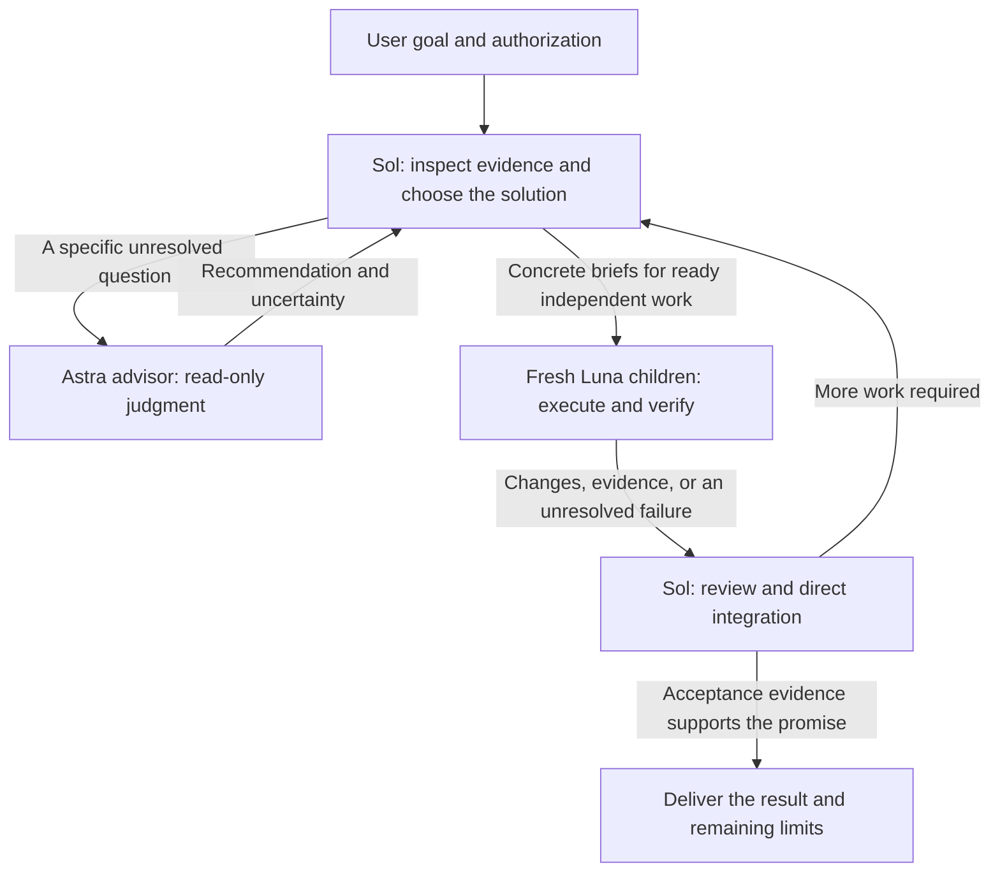

# PigeonStack

First, credit and thanks to [Lauren Tan (poteto)](https://github.com/poteto), the original author of [pstack](https://github.com/cursor/plugins/tree/f5bdd6826fd0a0d9cbc4347134c3a74a200b9d9d/pstack). PigeonStack builds on her work and adapts it for this Codex workflow.

English | [简体中文](README.zh-CN.md)

**A Codex workflow built around a capable Sol primary, a top-tier Astra advisor, and lower-cost Luna execution.**

PigeonStack, or 鸽栈, is PigeonYang's maintained collection of global Codex rules, a customized version of Lauren Tan's pstack, agent-role definitions, selected configuration, and a local synchronization script. It brings those parts into one source repository so that model responsibilities and installed instructions stay consistent.

The aim is high performance with cost-efficient collaboration. Sol owns the task and its decisions. Astra contributes deeper judgment where an unresolved question warrants it. Luna carries out small, well-specified assignments. Expensive reasoning goes to decisions that need it, and accepted decisions become concrete execution briefs that other agents can reuse.

This is a set of instructions, a packaged Codex plugin, and deployment tooling. It does not provide an MCP server or a separate autonomous scheduler. Installing it activates no timers, background agents, hooks, or remote services.

## Why this division of work

Multi-agent work becomes expensive when every child rediscovers the problem, chooses its own repair, or asks another model to repeat the same review. It becomes unreliable when a successful build is treated as proof that the user's workflow works.

PigeonStack gives one Primary responsibility for decisions and final acceptance. Children receive enough context to complete a bounded assignment and return evidence. Independent work can run concurrently, while dependencies and shared resources keep a single owner. The workflow favors a complete, verifiable result with the fewest necessary changes.

| Role | Responsibility | Local model and effort example |
| --- | --- | --- |
| Sol Primary | Understand the goal, diagnose, plan, select the solution, decompose work, dispatch children, direct integration, and accept the result. | Preferred `gpt-6-sol`, `high` |
| Astra advisor | Answer one difficult unresolved question using decisive evidence. Return a judgment, uncertainty, and a bounded verification path. The advisor is read-only. | `gpt-6-astra`, `high` |
| Astra author or executor | Write or review authoritative technical documents, or investigate one unresolved question read-only. Use a separate general execution role with explicit scope and permissions. | `gpt-6-astra`, `high` |
| Luna executor | Implement one Primary-specified repair or accepted design step, collect evidence through a prescribed read-only checklist, and run assigned checks. Return unexplained failures to the Primary. | `gpt-6-luna`, `max` |

These names express this project's model strategy and local configuration. Availability, model IDs, supported effort, and cost depend on your account and Codex client. This repository makes no measured speed, savings, or benchmark-superiority claim.

[MODELS.md](pstack/MODELS.md) defines the preferred routing. The checked-in [configuration](config/workflow.toml) currently selects `gpt-6.1-sol` at `high` for the Primary. An explicit user selection takes precedence over the preferred `gpt-6-sol` default. Editing a file does not switch a running Primary, and a model label does not establish the server's internal model mapping.

## How a task moves through Codex



Sol does not need an Astra consultation for every task. It consults the read-only advisor when the available evidence still leaves a consequential question unresolved. Authoritative architecture documents, technical designs, implementation plans, contracts, ADRs, and specifications have a separate rule: Astra at `high`, or a stronger model explicitly selected by the user, authors and reviews them. That work uses a general execution role with permission to write. The advisor role remains read-only, and Luna does not change contracts to make an implementation pass.

Routine authorized ZIP uploads and publishing, Git operations, installation, repository creation, established platform procedures, and ordinary public README prose use Luna at `max`. Provide an operation brief with the artifact, destination, authorized steps, success readback, and stop conditions. Astra handles authoritative technical documents and bounded read-only unresolved questions. Webpage implementation and refactoring return to Luna after Sol selects the solution; task size and visual complexity do not justify Astra execution. Other Astra execution requires an explicit task-specific user selection. Publication, unfamiliar tools, or an operational failure alone do not trigger Astra.

Before assigning implementation to Luna, the Primary supplies the following brief:

1. One defect or verifiable step, including the observed failure and decisive evidence.
2. The chosen mechanism, expected behavior, and concrete edit steps.
3. Allowed files and interfaces, resource ownership, and exclusions.
4. Exact checks and the observations that establish success.
5. Assumptions or failures that require a prompt return to the Primary.

A prescribed read-only collection task can precede diagnosis. It names the searches or observations to collect, and the Primary interprets the result. Luna does not receive open-ended architecture work or a batch of unexplained failures to repair.

Scheduling follows actual readiness. Dispatch independent assignments together, then dispatch newly unblocked work as results arrive. Serialize conflicting writes, shared-instance operations, and real dependencies. Each assignment gets a fresh child; a completed child is retired. When all useful work is delegated, use the host's maximum interruptible wait, currently `3600000` ms, instead of polling unchanged status. There are no mandatory model panels or tasks invented to fill slots.

For example, a user might ask:

> Fix the export error when a report has no rows. Preserve the current file format and verify the normal export path too.

The Primary inspects decisive evidence or assigns a specific reproduction checklist. After choosing the repair, it sends Luna a brief naming the affected producer, caller, checks, and return conditions. If the evidence leaves a consequential format decision unresolved, the Primary asks Astra that question. Luna returns the change and actual observations. The Primary reviews the diff and evidence before reporting what works. This example illustrates the workflow; it is not a recorded benchmark or test result.

## What the repository contains

| Source | Purpose |
| --- | --- |
| [AGENTS.md](AGENTS.md) | Global scope, authorization, delegation, scheduling, and acceptance rules. |
| [pstack/CODEX.md](pstack/CODEX.md) | Codex workflow activation, tool conversion, execution briefs, and deployment conventions. |
| [pstack/MODELS.md](pstack/MODELS.md) | Model IDs, reasoning effort, and the spawn contract. |
| [pstack/](pstack/) | The packaged pstack plugin, selected skills, playbooks, upstream material, and local adaptations. |
| [agents/](agents/) | `worker`, `poteto-agent`, and the read-only `astra-advisor` definitions. |
| [prompts/](prompts/) | The base instruction file referenced by the deployed configuration. |
| [config/workflow.toml](config/workflow.toml) | The allowlisted configuration keys managed by PigeonStack. |
| [scripts/sync.py](scripts/sync.py) | Read-only drift checks and one-way deployment with backups and readback. |

The authority is explicit. Global `AGENTS.md` owns policy, `CODEX.md` owns host mechanics, and `MODELS.md` owns model IDs and effort. Bundled skills supply procedures for selected steps. Upstream triggers and role defaults do not override the Codex host rules.

Load only the skills and references needed for the current decision. A known local repair does not need a new architecture study. Casual conversation and direct factual answers do not need a playbook. Some retained upstream material still names Cursor tools or optional external integrations; [CODEX.md](pstack/CODEX.md) explains host conversion, and [ADAPTATION.md](pstack/ADAPTATION.md) records the limits. The retained automation examples are dormant reference material.

## Inspect and adapt the source

Clone into a directory you choose:

```powershell
git clone https://github.com/PigeonAI-Yang/pigeonstack.git
Set-Location pigeonstack
```

The currently validated host is Windows with PowerShell. Synchronization requires Python 3.11 or newer. Real plugin installation requires a compatible Codex CLI and an existing local marketplace registration that resolves `pstack@personal`. Multi-agent execution also requires a Codex environment that exposes native child-agent tools and the selected models.

This repository reflects a working personal installation and needs path adaptation on another machine. Before targeting your live Codex home, review these locations:

- `DEFAULT_HOME` in [scripts/sync.py](scripts/sync.py) currently points to `J:/Users/yangda01/.codex`.
- [AGENTS.md](AGENTS.md), [CODEX.md](pstack/CODEX.md), and [poteto-agent.toml](agents/poteto-agent.toml) contain source or runtime paths for the owner's machine.
- [config/workflow.toml](config/workflow.toml) selects model defaults, agent settings, role files, and plugin enablement. Decide which settings you want to adopt before deployment.

The script does not register a marketplace or provide a zero-configuration installer. A `--codex-home` override does not rewrite every path embedded in instructions. Adapt the maintained source and the existing local marketplace registration before a real installation elsewhere.

### Preview in an isolated target

From the cloned repository, use a new sibling directory to inspect the managed output without targeting your live `.codex` directory:

```powershell
python scripts/sync.py check --codex-home ../pigeonstack-preview-codex --skip-plugin-install
python scripts/sync.py deploy --codex-home ../pigeonstack-preview-codex --skip-plugin-install
python scripts/sync.py check --codex-home ../pigeonstack-preview-codex --skip-plugin-install
```

The first check normally reports drift because the target is empty. Deployment writes managed files and configuration into the preview directory. The final check reports `status: ok` when they match. A nondefault target requires `--skip-plugin-install`, and source and target paths must not overlap.

This preview skips plugin installation and installed-cache checks. It proves the managed copy and configuration merge, not plugin activation or model behavior. The copied instructions retain any host paths you have not adapted.

### Deploy on the configured host

On the owner's current host, after reviewing the intended source changes and existing `pstack@personal` registration, use:

```powershell
Set-Location J:/PigeonYang/pigeonstack
python scripts/sync.py check
python scripts/sync.py deploy
python scripts/sync.py check
```

These commands target the configured live Codex home. Deployment can change global instructions and model settings. On another machine, complete the path and configuration review above before adopting this command sequence.

For a changed deployment, the script copies the managed files, merges the allowed configuration keys, and points `model_instructions_file` at the target's base prompt. When runtime or installed-cache drift exists, it invokes:

```powershell
codex plugin add pstack@personal --json
```

It then reads back the runtime files and configuration and compares installed plugin files with the source. A plugin installation failure can occur after runtime files were written; inspect the error and backup path instead of treating the operation as an automatic rollback.

`check` returns `0` for alignment and `1` for drift. Invalid input or an operational error returns `2`. A successful installation and matching files establish disk state. Verify instruction loading and actual model routing in a new Codex session before claiming the full collaboration behavior works on your host.

## Maintain one source of truth

The owner's deployment follows this direction:

```text
J:/PigeonYang/pigeonstack
    -> J:/Users/yangda01/.codex managed files and local-plugins/pstack
    -> installed pstack plugin cache
```

Edit the source repository. Runtime files and installed caches are deployment copies. The initial import was a snapshot, and synchronization is one-way. If you edit a runtime copy, review and deliberately bring the change back to the source before deployment.

The normal maintenance sequence is:

1. Edit the maintained source and validate the affected files.
2. For plugin changes, follow `CODEX.md` to update the plugin version and any existing marketplace cachebuster.
3. Run `python scripts/sync.py check` and review the expected drift.
4. Deploy the authorized change. Changed existing files receive backups under `<codex-home>/backups/pigeonstack/`.
5. Run `check` again, review the final diff and relevant behavior evidence, and commit when authorized.

An unchanged deployment creates no managed writes or backups. Deployment preserves unrelated parsed configuration values and does not delete extra runtime files. The installed-plugin check does report unexpected extra cache files. Unsupported managed multiline or complex configuration values fail before runtime writes.

The source contains no live credentials, conversation history, or runtime state. Keep local backups, authentication data, session records, and generated caches outside this repository. The configuration merge manages only its explicit allowlist plus the derived `model_instructions_file` path.

## Delivery boundaries

The rules preserve user changes and files of unknown origin. They do not automatically stash, reset, or clean a workspace. A question or diagnosis is read-only by default. Skills do not expand authorization, and publication, deployment, commits, destructive operations, and external messages require authorization for the current task.

Acceptance evidence must support the promised result. A build, mock, command receipt, or child report alone does not prove an actual business workflow succeeded. Use the existing UI, CLI, or business entry point when claiming that behavior. If a service is unavailable or access is denied, report the affected gap and finish independent authorized work.

These are agent instructions and configuration conventions. They are not runtime enforcement hooks. Keep disk synchronization, installed-plugin verification, instructions read in the current task, and behavior observed in a new session as separate claims.

## Contributing

Keep changes focused on an observed problem or current requirement. Use the existing source and verification entry points, preserve unrelated work, and describe the evidence for the change. Keep the English and Chinese introductions aligned.

Global instructions, role definitions, and rule updates remain in English. The Chinese README is public documentation. Follow the authoritative-document policy when changing architecture, contracts, or implementation plans. Preserve upstream attribution and record adapter changes in [ADAPTATION.md](pstack/ADAPTATION.md).

## Attribution and licenses

PigeonStack is maintained by PigeonYang. The underlying pstack workflows are Lauren Tan's work. This repository adapts pstack `0.15.2` from [the pinned upstream source](https://github.com/cursor/plugins/tree/f5bdd6826fd0a0d9cbc4347134c3a74a200b9d9d/pstack), commit `f5bdd6826fd0a0d9cbc4347134c3a74a200b9d9d`. Selected control and cleanup skills come from Cursor Team Kit in that same checkout.

[provenance.json](pstack/provenance.json) records imported files and source hashes. [ADAPTATION.md](pstack/ADAPTATION.md) records the Codex changes and their history. The original notices remain in [pstack/LICENSE](pstack/LICENSE) and [pstack/CURSOR-TEAM-KIT-LICENSE](pstack/CURSOR-TEAM-KIT-LICENSE).

Those MIT notices apply to the respective upstream material. This repository currently has no separate root license granting the same terms to all original PigeonStack content.
