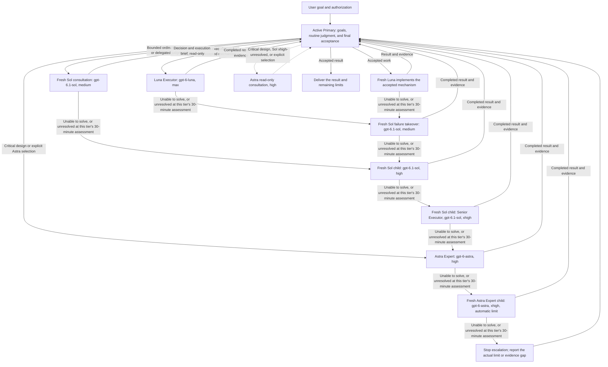

# PigeonStack: Codex Multi-Agent Workflow

First, credit and thanks to [Lauren Tan (poteto)](https://github.com/poteto), the original author of [pstack](https://github.com/cursor/plugins/tree/77526ffa67f8dafc698d14b5356e6d4fc78c3127/pstack). PigeonStack builds on her work and adapts it for this Codex workflow.

English | [简体中文](README.zh-CN.md)

[Documentation](https://pigeonai-yang.github.io/pigeonstack/) | [Getting started](https://pigeonai-yang.github.io/pigeonstack/getting-started/) | [FAQ](#faq) | [Issues](https://github.com/PigeonAI-Yang/pigeonstack/issues)

<p align="center">
  <a href="https://github.com/PigeonAI-Yang/pigeonstack/stargazers"></a>
  <a href="https://github.com/PigeonAI-Yang/pigeonstack/forks"></a>
  <a href="https://github.com/PigeonAI-Yang/pigeonstack/watchers"></a>
  <a href="#attribution-and-licenses"></a>
</p>
<p align="center">
  <a href="https://pigeonai-yang.github.io/pigeonstack/"></a>
  <a href="#how-a-task-moves-through-codex"></a>
  <a href="https://github.com/PigeonAI-Yang/pigeonstack/issues"></a>
  <a href="https://github.com/PigeonAI-Yang"></a>
  <a href="https://x.com/KimbomArtist"></a>
  <a href="https://www.xiaohongshu.com/user/profile/689af6b90000000019016082"></a>
</p>

**A Codex collaboration setup that keeps goals and acceptance with the Primary, gives specified execution to Luna, sends bounded ordinary judgment to Sol, and routes critical design or qualifying takeovers to Astra.**

PigeonStack, or 鸽栈, is PigeonYang's maintained Codex setup: global instructions, a customized version of Lauren Tan's pstack, agent-role definitions, selected host configuration, and a local synchronization script. It keeps the responsibilities and installed instructions reviewable from one source repository.

The active Primary retains the goal, constraints, routine judgments, coordination, and final acceptance. Luna is the default for execution under an accepted mechanism. When an ordinary question needs delegated judgment, a fresh Sol starts at `medium` and returns a decision with a concrete execution brief; after the Primary accepts it, a fresh Luna carries out the approved work. A genuine failure takeover keeps its Sol or Astra owner responsible for diagnosis, implementation, and verification through completion. Critical design decisions can go directly to Astra.

This is a set of instructions, a packaged Codex plugin, and deployment tooling. It does not provide an MCP server or a separate autonomous scheduler, and it starts no background timers, resident agents, or remote services. The repository does bundle a bounded `SessionStart` hook; host configuration and trust govern whether it activates.

## SessionStart context hook

The hook reads only the current region of a saved task record whose session and workspace match the host event. On Windows, its wrapper returns reader failures through the standard `systemMessage`. Targeted diagnostic tests passed, but a natural host trigger and the original reported failure cause remain unconfirmed. Source inclusion or installation alone does not prove host activation or trust. The hook does not monitor later business state, intercept agent dispatch, or enforce coordinator reminders. See the [hook contract](pstack/hooks/README.md) and [Codex host adapter](pstack/CODEX.md).

## Start here

PigeonStack keeps global Codex rules, agent roles, configuration, and the adapted pstack plugin in Git, then synchronizes them to a Codex host.

For a safe first check, use [Preview in an isolated target](#preview-in-an-isolated-target) or follow the [getting started guide](https://pigeonai-yang.github.io/pigeonstack/getting-started/).

Not sure which pstack skill fits your task? Ask `/poteto-help`. It reads the bundled guides, recommends a relevant skill, and can provide one example prompt. Asking for help does not start the suggested work. Codex model selection and permissions follow this repository’s GPT configuration.

The verified host is Windows with PowerShell, and the sync script requires Python 3.11 or newer. Real plugin installation also requires a compatible Codex CLI and an existing local marketplace registration for `pstack@personal`.

- Maintain global Codex rules in Git and review them with the source.
- Route specified execution under an accepted mechanism to Luna. Use a bounded Sol consultation when an ordinary question needs delegated judgment, then send accepted work to a fresh Luna. Route critical design directly to Astra.
- Keep the maintained source, runtime files, and versioned plugin cache in sync.

## Why this division of work

Multi-agent work becomes expensive when every child rediscovers the problem, chooses its own repair, or asks another model to repeat the same review. It becomes unreliable when a successful build is treated as proof that the user's workflow works.

PigeonStack gives one Primary responsibility for decisions and final acceptance. Children receive enough context to complete a bounded assignment and return evidence. Independent work can run concurrently, while dependencies and shared resources keep a single owner. The workflow favors a complete, verifiable result with the fewest necessary changes.

### Coordinating multiple workstreams

Each workstream Main owns its assigned scope, while the original user goal remains authoritative until final acceptance evidence shows it is met or the user changes scope. Completing a phase dispatches the next ready work under existing authorization; missing input blocks only dependent work. The task ends at final acceptance or a user change/Stop, and a temporary wait is not completion. Codex hosts may provide an authorized thread heartbeat for later follow-up; PigeonStack installation registers none, and runtime behavior remains unverified ([host guidance](pstack/CODEX.md)). See [COORDINATOR.md](pstack/COORDINATOR.md); these are instructions, not runtime enforcement.

| Role | Responsibility | Recommended role model and effort |
| --- | --- | --- |
| Primary | Own the goal, constraints, routine judgments, coordination, and final acceptance. | `gpt-6.1-sol`, `high` recommended default |
| Luna Executor | Handle routine implementation and operations, prescribed read-only evidence collection, assigned checks, and faithful updates to approved content. Return the result and evidence to the Primary. | `gpt-6-luna`, `max` |
| Sol Senior Executor | Handle a bounded ordinary question or delegated judgment at `medium`, returning a decision and execution brief. Consultation is read-only; accepted implementation goes to a fresh Luna. A genuine failure takeover retains diagnosis, implementation, and verification. | `gpt-6.1-sol`, `medium` first |
| Astra Expert | Directly handle master or system architecture, key interface and data-contract design, and consequential tradeoffs. Other takeovers start only after an actual Sol `xhigh` failure or an unresolved 30-minute assessment, or an explicit task-specific Astra selection. A takeover owns diagnosis, implementation, and verification. Start at `high`; unresolved work can move to a fresh Expert at `xhigh`, the automatic limit. | `gpt-6-astra`, `high` first |

Read-only Astra consultation is available for critical design, a question still unresolved after an actual Sol `xhigh` failure or unresolved 30-minute assessment, or an explicit task-specific Astra selection. Ordinary bounded consultations start with Sol at `medium` and return a decision and execution brief; they do not implement the application. The Primary dispatches each consultation and child. Takeovers use the general execution role with an explicit model and effort.

These names express this project's model strategy and local configuration. Availability, model IDs, supported effort, and cost depend on your account and Codex client. This repository makes no measured speed, savings, or benchmark-superiority claim.

[MODELS.md](pstack/MODELS.md) recommends `gpt-6.1-sol` at `high` as the Primary role default. The checked-in [configuration](config/workflow.toml) records this checkout's explicit `gpt-6-astra` at `high` selection. These values serve different purposes: changing either file does not switch an already-running session, and a model label does not prove the server's internal model mapping. An explicit task-specific model and effort selection takes precedence over role defaults. A Sol Senior Executor is a separate child that starts at `medium`; the same unresolved problem may advance through Sol `high` and `xhigh`, then Astra `high` and `xhigh`.

## How a task moves through Codex



Keep ordinary implementation and operations with Luna under an accepted mechanism. When the Primary needs delegated ordinary judgment, send one bounded question or decision to a fresh Sol at `medium`; it returns a decision and execution brief, then the Primary directs a fresh Luna to carry out accepted work. Consultation remains read-only. If Luna cannot complete an assigned task, a fresh Sol takeover at `medium` owns the same problem through diagnosis, implementation, and verification. For an unresolved question or takeover, follow Sol `medium`, `high`, and `xhigh` before Astra `high`; do not skip a tier. Send critical architecture, key interfaces and data contracts, or consequential tradeoffs directly to Astra. A technical-document label or Primary uncertainty alone does not trigger Astra. Explicit task-specific model and effort selections override role defaults. The Primary retains routine judgments and final acceptance.

Use Luna at `max` for routine authorized ZIP uploads and publishing, Git operations, installation, repository creation, established platform procedures, routine implementation, and faithful updates to approved public prose or webpages. Provide an operation brief with the artifact, destination, authorized steps, success readback, and stop conditions. Keep core architecture decisions out of Luna's scope. Task size, visual complexity, a technical-document label, or uncertainty from the Primary alone do not trigger Astra. Publication, unfamiliar tools, or an operational failure alone do not change the assignment.

Before assigning implementation to Luna, the Primary supplies the following brief:

1. One defect or verifiable step, including the observed failure and decisive evidence.
2. The chosen mechanism, expected behavior, and concrete edit steps.
3. Allowed files and interfaces, resource ownership, and exclusions.
4. Exact checks and the observations that establish success.
5. Assumptions or failures that require a prompt return to the Primary.

A prescribed read-only collection task can precede diagnosis. It names the searches or observations to collect, and the Primary interprets the result. Luna does not receive open-ended architecture work or a batch of unexplained failures to repair. Use a bounded Sol consultation for an ordinary question that needs delegated judgment; it returns a decision and execution brief, not application implementation. Reserve direct Astra work for master or system architecture, key interface and data-contract design, and consequential tradeoffs.

For a takeover, give the Senior Executor or Expert the goal, constraints, evidence, scope, permissions, and acceptance criteria. They choose the technical solution, make the necessary changes, and verify a complete result without per-step Primary approval. They return early only for an external blocker, a genuine user decision, a required scope or permission change, or an urgent correctness or ownership issue.

Scheduling follows actual readiness. Dispatch independent assignments together, then dispatch newly unblocked work as results arrive. Serialize conflicting writes, shared-instance operations, and real dependencies. Each assignment gets a fresh child; a completed child is retired. When no independent work remains, use the default 30-minute interruptible wait (`1800000` ms); it returns early on new input or child events. There are no mandatory model panels or tasks invented to fill slots. Keep image generation, editing, viewing, visual analysis, and related transfers serial across the Primary and its children.

When an executor reports that it cannot solve the problem, advance immediately to the next tier. Otherwise, assess unresolved work 30 minutes after the first dispatch at that model and effort tier. A same-tier retry or replacement does not reset the clock. Carry evidence, failed attempts, and total elapsed time across upgrades. Routine execution that starts at Luna follows Luna `max`, Sol `medium`, Sol `high`, Sol `xhigh`, Astra `high`, and a fresh Astra child at `xhigh` when it fails or remains unresolved. Bounded ordinary consultations start at Sol `medium` and keep their read-only scope through upgrades; a genuine failure takeover starts at Sol `medium` and owns the repair through verification. Critical design assignments start at Astra `high`. A successful tier ends the escalation path. Each new task starts at its role's default unless the user explicitly selects a model or effort. Only a handoff for the same unresolved task advances to the next tier; same-tier retries or replacements keep that tier and its clock. External blockers, including unavailable models or effort levels, credentials, access, permissions, or services, do not trigger reasoning escalation. A confirmed healthy long-running build, download, or training run is not a reasoning failure and continues through its existing observation loop. If Astra at `xhigh` cannot solve the problem or it remains unresolved at its 30-minute assessment, stop and report the actual limit or missing evidence. Do not automatically escalate Astra to `max` or `ultra`, or restart the cycle. These assessments use existing waits and task context; they are not automatic timers.

ComputerUse actions stay with the Primary because child tools do not expose ComputerUse. Do not delegate actions requiring ComputerUse. A Senior Executor or Expert may request a named UI action and its observed result, then continue the same problem. The request asks for an observation, not a solution decision. Text, code, CLI, and API work remain delegable. This rule adds no tools or permission flow.

For example, a user might ask:

> Fix the export error when a report has no rows. Preserve the current file format and verify the normal export path too.

The Primary inspects decisive evidence or assigns a specific reproduction checklist, then gives Luna the chosen repair and exact checks. If Luna reports that it cannot solve the export error, the Primary hands the same problem to a fresh Sol Senior Executor at `medium`. An unresolved handoff advances through Sol `high` and `xhigh`, then Astra `high` and `xhigh` if needed. The Senior Executor or Expert chooses, implements, and verifies the solution, then returns the result and evidence to the Primary for final acceptance. This example describes the workflow; it is not a completed test record or a performance measurement.

## What the repository contains

| Source | Purpose |
| --- | --- |
| [AGENTS.md](AGENTS.md) | Global scope, authorization, delegation, scheduling, and acceptance rules. |
| [pstack/CODEX.md](pstack/CODEX.md) | Codex workflow activation, tool conversion, execution briefs, and deployment conventions. |
| [pstack/MODELS.md](pstack/MODELS.md) | Model IDs, reasoning effort, and the spawn contract. |
| [pstack/](pstack/) | The packaged pstack plugin, selected skills, playbooks, upstream material, and local adaptations. |
| [agents/](agents/) | `worker`, `poteto-agent`, and the read-only `astra-advisor` compatibility role for optional consultation. |
| [prompts/](prompts/) | The base instruction file referenced by the deployed configuration. |
| [config/workflow.toml](config/workflow.toml) | The allowlisted configuration keys managed by PigeonStack. |
| [scripts/sync.py](scripts/sync.py) | Read-only drift checks and one-way deployment with backups and readback. |

The authority is explicit. Global `AGENTS.md` owns policy, `CODEX.md` owns host mechanics, and `MODELS.md` owns model IDs and effort. Bundled skills supply procedures for selected steps. Upstream triggers and role defaults do not override the Codex host rules.

Load only the skills and references needed for the current decision. A known local repair does not need a new architecture study. Casual conversation and direct factual answers do not need a playbook. Some retained upstream material still names Cursor tools or optional external integrations; [CODEX.md](pstack/CODEX.md) explains host conversion, and [ADAPTATION.md](pstack/ADAPTATION.md) records the limits. The retained automation examples are dormant reference material.

## Inspect and adapt the source

Clone into a directory you choose:

```powershell
git clone https://github.com/PigeonAI-Yang/pigeonstack.git
Set-Location pigeonstack
```

The currently validated host is Windows with PowerShell. Synchronization requires Python 3.11 or newer. Real plugin installation requires a compatible Codex CLI and an existing local marketplace registration that resolves `pstack@personal`. Multi-agent execution also requires a Codex environment that exposes native child-agent tools and the selected models.

This repository reflects a working personal installation and needs path adaptation on another machine. Before targeting your live Codex home, review these locations:

- `DEFAULT_HOME` in [scripts/sync.py](scripts/sync.py) currently points to `J:/Users/yangda01/.codex`.
- [AGENTS.md](AGENTS.md), [CODEX.md](pstack/CODEX.md), and [poteto-agent.toml](agents/poteto-agent.toml) contain source or runtime paths for the owner's machine.
- [config/workflow.toml](config/workflow.toml) records this checkout's explicit `gpt-6-astra` at `high` selection, agent settings, role files, and plugin enablement. Review the settings you want to adopt before deployment; source-file edits do not switch a running session.

The script does not register a marketplace or provide a zero-configuration installer. A `--codex-home` override does not rewrite every path embedded in instructions. Adapt the maintained source and the existing local marketplace registration before a real installation elsewhere.

### Preview in an isolated target

From the cloned repository, use a new sibling directory to inspect the managed output without targeting your live `.codex` directory:

```powershell
python scripts/sync.py check --codex-home ../pigeonstack-preview-codex --skip-plugin-install
python scripts/sync.py deploy --codex-home ../pigeonstack-preview-codex --skip-plugin-install
python scripts/sync.py check --codex-home ../pigeonstack-preview-codex --skip-plugin-install
```

The first check normally reports drift because the target is empty. Deployment writes managed files and configuration into the preview directory. The final check reports `status: ok` when they match. A nondefault target requires `--skip-plugin-install`, and source and target paths must not overlap.

This preview skips plugin installation and installed-cache checks. It proves the managed copy and configuration merge, not plugin activation or model behavior. The copied instructions retain any host paths you have not adapted.

### Deploy on the configured host

On the owner's current host, after reviewing the intended source changes and existing `pstack@personal` registration, use:

```powershell
Set-Location J:/PigeonYang/pigeonstack
python scripts/sync.py check
python scripts/sync.py deploy
python scripts/sync.py check
```

These commands target the configured live Codex home. Deployment can change global instructions and model settings. On another machine, complete the path and configuration review above before adopting this command sequence.

For a changed deployment, the script copies the managed files, merges the allowed configuration keys, and points `model_instructions_file` at the target's base prompt. When runtime or installed-cache drift exists, it invokes:

```powershell
codex plugin add pstack@personal --json
```

It then reads back the runtime files and configuration and compares installed plugin files with the source. A plugin installation failure can occur after runtime files were written; inspect the error and backup path instead of treating the operation as an automatic rollback.

`check` returns `0` for alignment and `1` for drift. Invalid input or an operational error returns `2`. A successful installation and matching files establish disk state. Verify instruction loading and actual model routing in a new Codex session before claiming the full collaboration behavior works on your host.

## Maintain one source of truth

The owner's deployment follows this direction:

```text
J:/PigeonYang/pigeonstack
    -> J:/Users/yangda01/.codex managed files and local-plugins/pstack
    -> installed pstack plugin cache
```

Edit the source repository. Runtime files and installed caches are deployment copies. The initial import was a snapshot, and synchronization is one-way. If you edit a runtime copy, review and deliberately bring the change back to the source before deployment.

The normal maintenance sequence is:

1. Edit the maintained source and validate the affected files.
2. For plugin changes, follow `CODEX.md` to update the plugin version and any existing marketplace cachebuster.
3. Run `python scripts/sync.py check` and review the expected drift.
4. Deploy the authorized change. Changed existing files receive backups under `<codex-home>/backups/pigeonstack/`.
5. Run `check` again, review the final diff and relevant behavior evidence, and commit when authorized.

An unchanged deployment creates no managed writes or backups. Deployment preserves unrelated parsed configuration values and does not delete extra runtime files. The installed-plugin check does report unexpected extra cache files. Unsupported managed multiline or complex configuration values fail before runtime writes.

The source contains no live credentials, conversation history, or runtime state. Keep local backups, authentication data, session records, and generated caches outside this repository. The configuration merge manages only its explicit allowlist plus the derived `model_instructions_file` path.

## Delivery boundaries

The rules preserve user changes and files of unknown origin. They do not automatically stash, reset, or clean a workspace. A question or diagnosis is read-only by default. Skills do not expand authorization, and publication, deployment, commits, destructive operations, and external messages require authorization for the current task.

Acceptance evidence must support the promised result. A build, mock, command receipt, or child report alone does not prove an actual business workflow succeeded. Use the existing UI, CLI, or business entry point when claiming that behavior. If a service is unavailable or access is denied, report the affected gap and finish independent authorized work.

Prioritize the authorized normal business workflow through existing entry points. When an actual bug occurs or is reported, retain sufficient evidence, diagnose and repair the cause within scope, then rerun the affected real workflow and targeted regression checks. Address the bug when encountered, without waiting for the whole workflow to finish. Block only affected and dependent actions, and continue independent valid work. Report any outcome that an unavailable workflow prevents you from verifying. Targeted regression does not authorize a full test suite.

During normal task work, reuse existing scripts, CLIs, and business entry points. A minimal tool may help with repeated deterministic work only when the need is observed and authorized. Give the responsible agent a way to inspect the real result. Before escalating models, distinguish gaps in tools, feedback, or the environment from reasoning failures. At completion, use evidence already collected to identify recurring mistakes and improve the smallest relevant code, tool, skill, or rule within scope. Record unrelated findings in the existing project record. These habits add no mandatory project scan, report, skill, harness, validation gate, or automatic retrospective.

A validation gate is a mandatory check that must pass before an action can proceed. Add a new gate only for an evidence-confirmed problem or an explicit current requirement. An unverified hypothesis or hypothetical future failure cannot become a new gate or prerequisite. A confirmed bug does not automatically require a gate. If needed, scope the gate to the affected action and boundary, and verify that it catches the failure or enforces the requirement without unnecessarily blocking valid work. Existing required checks, explicit current requirements, and safety, permission, and data-integrity boundaries remain in force before any bug occurs.

These are agent instructions and configuration conventions. They are not runtime enforcement hooks. Keep disk synchronization, installed-plugin verification, instructions read in the current task, and behavior observed in a new session as separate claims.

## Contributing

Keep changes focused on an observed problem or current requirement. Use the existing source and verification entry points, preserve unrelated work, and describe the evidence for the change. Keep the English and Chinese introductions aligned.

Global instructions, role definitions, and rule updates remain in English. The Chinese README is public documentation. Choose the role by decision scope, not file type: Luna carries out accepted mechanisms; Sol provides bounded ordinary judgment and returns an execution brief; only a genuine failure takeover stays with its Sol or Astra owner through implementation and verification. Assign master or system architecture, key interface and data-contract design, and consequential tradeoffs to Astra. Preserve upstream attribution and record adapter changes in [ADAPTATION.md](pstack/ADAPTATION.md).

<a id="faq"></a>

## FAQ

### Is PigeonStack an MCP server, a skill, or an agent?

It is a repository containing a Codex plugin and the instructions and tools that support it. The plugin bundles selected pstack skills and the Codex adapter; global rules, role definitions, configuration, and the synchronization script live alongside it in the repository. It does not run an MCP server or an autonomous scheduler.

### How does PigeonStack differ from pstack?

PigeonStack adapts Lauren Tan's pstack for Codex. It adds Codex-specific global rules, a host adapter, and versioned synchronization for runtime files and the plugin cache. Lauren Tan remains the credited original author. See [Attribution and licenses](#attribution-and-licenses).

### Can I preview PigeonStack without changing my `.codex` directory?

Yes. Follow the isolated-target preview above with a new `--codex-home` path outside your live `.codex` directory and `--skip-plugin-install`. The script writes managed files and merged configuration only to that target. It does not install the plugin in or change your live Codex home, and it cannot prove model behavior.

### Does PigeonStack make Codex faster or cheaper?

No speed or cost benchmarks are published. Cost-efficient collaboration is a design goal, not a measured result. Model access and native child-agent support depend on your Codex host and account.

## Attribution and licenses

PigeonStack is maintained by PigeonYang. The underlying pstack workflows are Lauren Tan's work. This repository adapts pstack `0.15.13` from [the pinned upstream source](https://github.com/cursor/plugins/tree/77526ffa67f8dafc698d14b5356e6d4fc78c3127/pstack), commit `77526ffa67f8dafc698d14b5356e6d4fc78c3127`. Selected control and cleanup skills come from Cursor Team Kit in that same checkout.

Based on pstack 0.15.13, including `/correct` for recurring agent mistakes, `/benchmark-checklist` for performance evidence, and `/principle-explain-the-number` for explaining measurements. Upstream workflows are adapted to Codex; model selection and escalation follow this project's GPT configuration.

[provenance.json](pstack/provenance.json) records imported files and source hashes. [ADAPTATION.md](pstack/ADAPTATION.md) records the Codex changes and their history. The original notices remain in [pstack/LICENSE](pstack/LICENSE) and [pstack/CURSOR-TEAM-KIT-LICENSE](pstack/CURSOR-TEAM-KIT-LICENSE).

Those MIT notices apply to the respective upstream material. This repository currently has no separate root license granting the same terms to all original PigeonStack content.
