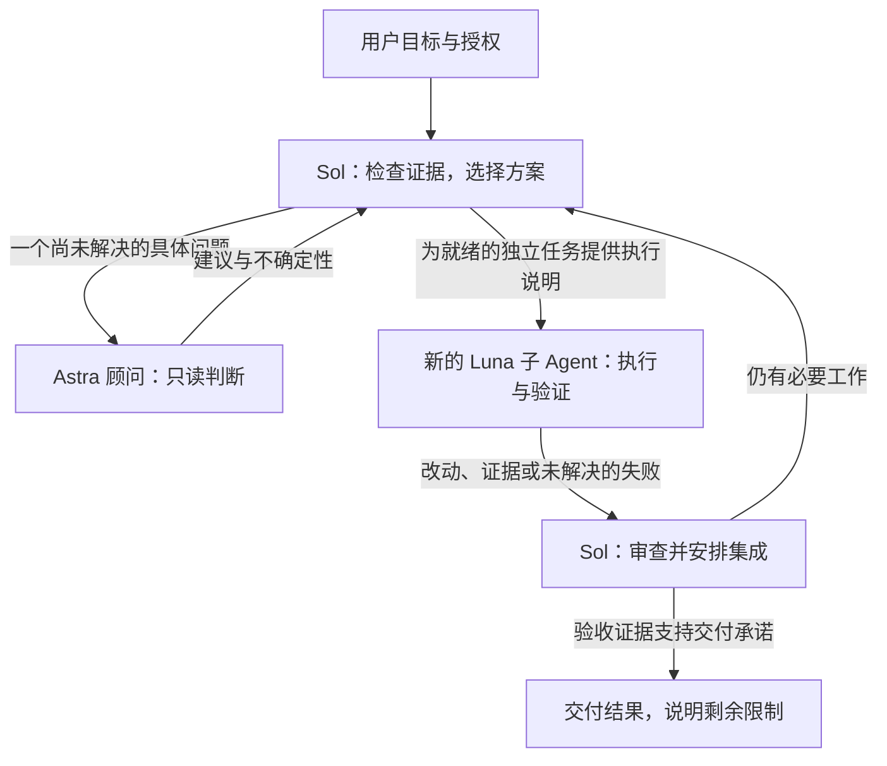

# PigeonStack · 鸽栈：Codex 多 Agent 协作工作流

首先致敬并感谢 [Lauren Tan（poteto）](https://github.com/poteto)，[pstack](https://github.com/cursor/plugins/tree/f5bdd6826fd0a0d9cbc4347134c3a74a200b9d9d/pstack) 的原作者。PigeonStack 基于她的工作，为这套 Codex 协作流程做了定制适配。

[English](README.md) | 简体中文

[文档](https://pigeonai-yang.github.io/pigeonstack/zh/) | [快速开始](https://pigeonai-yang.github.io/pigeonstack/zh/getting-started/) | [常见问题](#faq) | [问题反馈](https://github.com/PigeonAI-Yang/pigeonstack/issues)

**一套 Codex 协作流程：Sol 负责决策，Astra 回答尚未解决的问题，Luna 执行范围明确的实现任务。**

PigeonStack 是 PigeonYang 维护的一套 Codex 工作配置，将全局规则、Lauren Tan 的 pstack 定制版、Agent 角色定义、选定的配置项和本地同步脚本放在同一个源码仓库里。模型职责与实际安装的指令因此有了统一的维护入口。

它追求高性能、高性价比的协作。Sol 对任务和决策负责，Astra 在疑难问题上提供更深入的判断，Luna 执行范围明确的小任务。把昂贵的推理用在需要它的决策上，再将已确定的方案写成其他 Agent 可以直接执行的任务说明。

仓库交付的是指令、打包好的 Codex 插件和部署工具，不提供 MCP 服务或独立的自动调度器。安装不会启动定时任务、常驻 Agent、钩子或远程服务。

## 从这里开始

PigeonStack 将 Codex 全局规则、Agent 角色、配置和适配后的 pstack 插件保存在 Git 中，再同步到 Codex 宿主。

首次检查时，先看[独立目录预览](#在独立目录中预览)，或阅读[快速开始指南](https://pigeonai-yang.github.io/pigeonstack/zh/getting-started/)。

已验证的宿主是 Windows 与 PowerShell，同步脚本要求 Python 3.11 或更高版本。真正安装插件还需要兼容的 Codex CLI，以及已有的、能解析 `pstack@personal` 的本地插件市场注册。

- 在 Git 中维护 Codex 全局规则，并与源码一起审查改动。
- 由 Sol 选定修复方案，再把明确的代码改动交给 Luna。
- 保持维护中的源码、运行时文件和带版本的插件缓存同步。

## 为什么这样分工

如果每个子 Agent 都重新研究问题、自行决定修复方案，或者再找一个模型重复评审，多 Agent 协作就容易增加成本。如果把构建通过当成用户流程成功，交付结果也会失真。

PigeonStack 让一个主控对关键决策和最终验收负责。子 Agent 获取完成当前任务所需的上下文，执行边界明确的工作，再带回证据。独立任务可以并行，存在依赖或共用资源的操作则保留单一负责人。目标是用必要的最少改动交付完整、可验证的结果。

| 角色 | 职责 | 本机模型与推理强度示例 |
| --- | --- | --- |
| Sol 主控 | 理解目标、诊断、规划、选择方案、拆分任务、调度子 Agent、安排集成，并做最终验收。 | 首选 `gpt-6-sol`，`high` |
| Astra 顾问 | 针对一个尚未解决的疑难问题，根据关键证据给出判断、不确定性和有限的验证路径。顾问只读。 | `gpt-6-astra`，`high` |
| Astra 文档作者或执行者 | 编写或评审权威技术文档，或针对一个未解决的问题开展只读调查。使用独立的通用执行角色，明确范围与权限。 | `gpt-6-astra`，`high` |
| Luna 执行者 | 实现主控选定的一项修复或已认可的设计步骤，按只读清单采集证据，运行指定检查。无法解释的失败交回主控。 | `gpt-6-luna`，`max` |

这些名称表达的是本项目的模型使用策略和本机配置。实际可用模型、模型 ID、推理强度与费用取决于账号和 Codex 客户端。仓库没有提供速度提升、成本节省或跑分领先的实测承诺。

[MODELS.md](pstack/MODELS.md) 定义首选路由。仓库中的[配置文件](config/workflow.toml)目前将主控设为 `gpt-6.1-sol`、`high`。用户明确选择的模型优先于首选的 `gpt-6-sol` 默认值。修改文件不会切换正在运行的主控，模型标签也不能证明服务端内部的模型映射。

## 一个任务如何完成



Sol 无须每次都咨询 Astra。只有现有证据仍不足以解决一个重要问题时，才调用只读顾问。权威架构文档、技术设计、实现计划、接口与数据契约、ADR 和规范另有明确规则：由 `high` 强度的 Astra，或用户明确指定的更强模型负责撰写和评审。此类工作使用有写入权限的通用执行角色。顾问角色仍然只读，Luna 不得为了让实现通过而修改契约。

常规的 ZIP 上传与发布、Git 操作、安装、创建代码仓库、按既定平台流程执行，以及普通公开 README 文案，使用 `max` 强度的 Luna。操作说明需列明产物、目标位置、已授权步骤、成功后的回读方式和停止条件。Astra 负责权威技术文档及具体疑难问题的只读调查。网页实现与重构由 Sol 确定方案后交给 Luna；任务规模和视觉复杂度不构成调用 Astra 执行的理由。其他 Astra 执行须由用户针对当前任务明确指定。发布、陌生工具或操作失败本身都不构成调用 Astra 的理由。

主控将实现工作交给 Luna 前，需要写清以下内容：

1. 一个缺陷或可独立验证的步骤，包括实际失败和关键证据。
2. 已选定的机制、预期行为和具体修改步骤。
3. 允许修改的文件与接口、资源归属，以及排除范围。
4. 要运行的检查，以及哪些观察结果可以证明成功。
5. 哪些假设不成立或失败出现时，必须及时交回主控。

按清单采集只读证据可以先于诊断。此类任务明确指定搜索或观察内容，由主控解释结果。Luna 不接收开放式架构决策，也不接收一批原因未明的失败并自行修复。

调度以实际就绪状态为准。独立任务一起派发，有任务完成后立即推进新解锁的工作。冲突写入、共用实例操作和真实依赖需要串行。每次任务都创建新的子 Agent，已完成的子 Agent 不再复用。没有独立工作可做时，使用宿主支持的最大可中断等待，当前为 `3600000` 毫秒，避免反复查询未变化的状态。不强制组织模型评审团，也不为了填满并发槽而制造任务。Primary 与子 Agent 之间的生图、图像编辑、查看、视觉分析及相关传输需要串行，一次只处理一项。

例如，用户可以提出：

> 修复报表没有数据行时的导出错误。保持现有文件格式，同时验证正常导出流程。

主控先检查关键证据，或安排明确的复现清单。选定修复方案后，再把涉及的数据生成方、调用方、验证项和返回条件写给 Luna。如果证据仍不足以解决一个重要的格式问题，主控就将这个具体问题交给 Astra。Luna 返回改动与实际观察，主控审查差异和证据后，再报告哪些行为已经成立。这个例子用于说明工作方式，不是已完成的测试记录或性能测量。

## 仓库里有什么

| 源码位置 | 用途 |
| --- | --- |
| [AGENTS.md](AGENTS.md) | 全局范围、授权、委派、调度与验收规则。 |
| [pstack/CODEX.md](pstack/CODEX.md) | Codex 工作流入口、工具转换、执行说明与部署约定。 |
| [pstack/MODELS.md](pstack/MODELS.md) | 模型 ID、推理强度与子 Agent 创建约定。 |
| [pstack/](pstack/) | 打包的 pstack 插件、选定技能、操作流程、上游资料和本地适配。 |
| [agents/](agents/) | `worker`、`poteto-agent` 与只读 `astra-advisor` 的角色定义。 |
| [prompts/](prompts/) | 部署配置所引用的基础指令文件。 |
| [config/workflow.toml](config/workflow.toml) | PigeonStack 管理的配置白名单。 |
| [scripts/sync.py](scripts/sync.py) | 只读差异检查，以及带备份和回读验证的单向部署。 |

规则的归属明确：全局 `AGENTS.md` 管政策，`CODEX.md` 管宿主机制，`MODELS.md` 管模型 ID 和推理强度。随附技能为选中的步骤提供做法。上游技能的触发条件和角色默认值不能覆盖 Codex 宿主规则。

只加载当前决策需要的技能与参考资料。已知的局部修复不必重新做架构研究，闲聊和直接事实问答也不必启动完整流程。保留的部分上游内容仍使用 Cursor 工具名，或依赖可选的外部集成。[CODEX.md](pstack/CODEX.md) 说明宿主转换方式，[ADAPTATION.md](pstack/ADAPTATION.md) 记录适配边界。仓库保留的自动化示例仅作参考，未启用。

## 检查并适配源码

在你选择的目录中克隆仓库：

```powershell
git clone https://github.com/PigeonAI-Yang/pigeonstack.git
Set-Location pigeonstack
```

当前验证过的宿主环境是 Windows 与 PowerShell。同步脚本要求 Python 3.11 或更高版本。真正安装插件需要兼容的 Codex CLI，以及已经存在、能够解析 `pstack@personal` 的本地插件市场注册。多 Agent 执行还需要 Codex 环境提供原生子 Agent 工具，并且账号可以使用所选模型。

这是从个人实际使用环境整理出来的仓库，换机器时需要适配路径。将目标指向真实 Codex 目录之前，先检查这些位置：

- [scripts/sync.py](scripts/sync.py) 中的 `DEFAULT_HOME` 当前固定为 `J:/Users/yangda01/.codex`。
- [AGENTS.md](AGENTS.md)、[CODEX.md](pstack/CODEX.md) 和 [poteto-agent.toml](agents/poteto-agent.toml) 含有维护者机器上的源码或运行时路径。
- [config/workflow.toml](config/workflow.toml) 指定模型默认值、Agent 设置、角色文件和插件启用项。部署前先确定要采用哪些设置。

脚本不会自动注册插件市场，也不是零配置安装器。`--codex-home` 参数不会重写指令中嵌入的所有路径。在其他位置正式安装前，需要修改维护中的源码，并适配已有的本地插件市场注册。

### 在独立目录中预览

在克隆后的仓库目录中，使用一个新的同级目录查看同步结果，避免直接指向日常使用的 `.codex`：

```powershell
python scripts/sync.py check --codex-home ../pigeonstack-preview-codex --skip-plugin-install
python scripts/sync.py deploy --codex-home ../pigeonstack-preview-codex --skip-plugin-install
python scripts/sync.py check --codex-home ../pigeonstack-preview-codex --skip-plugin-install
```

首次检查通常会报告差异，因为目标目录为空。部署会将受管理的文件和配置写入预览目录，最后一次检查在内容一致时返回 `status: ok`。非默认目标必须带 `--skip-plugin-install`，源码目录与目标目录不能重叠。

这个预览会跳过插件安装和已安装缓存检查。它验证的是文件副本和配置合并，不能证明插件已激活或模型协作行为已经生效。尚未适配的宿主路径仍会保留在复制后的指令里。

### 在已配置的宿主上部署

在维护者当前机器上，审查目标改动和已有的 `pstack@personal` 注册后，使用：

```powershell
Set-Location J:/PigeonYang/pigeonstack
python scripts/sync.py check
python scripts/sync.py deploy
python scripts/sync.py check
```

这些命令指向配置中的真实 Codex 目录，会更新全局指令和模型设置。在其他机器上采用同样的命令顺序前，先完成上面的路径与配置检查。

存在改动时，脚本复制受管理文件、合并白名单配置项，并将 `model_instructions_file` 指向目标目录里的基础提示文件。如果运行时或已安装缓存存在差异，还会调用：

```powershell
codex plugin add pstack@personal --json
```

随后脚本回读运行时文件和配置，并将安装后的插件文件与源码比较。插件安装可能在运行时文件已经写入后失败；需要查看错误与备份路径，不能将失败理解为自动回滚。

`check` 在内容一致时返回 `0`，存在差异时返回 `1`。参数无效或操作出错时返回 `2`。安装成功、文件一致只能证明磁盘状态；要确认完整协作行为在自己的宿主上成立，还需要在新的 Codex 会话中验证指令加载和实际模型路由。

## 只维护一份源码

维护者机器上的部署方向为：

```text
J:/PigeonYang/pigeonstack
    -> J:/Users/yangda01/.codex 中的受管理文件和 local-plugins/pstack
    -> 已安装的 pstack 插件缓存
```

修改源码仓库，运行时文件与安装缓存都作为部署副本。首次导入是一次快照，之后仍是单向同步。如果改动了运行时副本，需要先审查并明确带回源码，再做部署。

日常维护按以下顺序进行：

1. 修改维护中的源码，验证受影响的文件。
2. 涉及插件改动时，按照 `CODEX.md` 更新插件版本和已有插件市场的缓存版本标记。
3. 运行 `python scripts/sync.py check`，审查预期差异。
4. 部署已授权的改动。被覆盖的现有文件会备份到 `<codex-home>/backups/pigeonstack/`。
5. 再次运行 `check`，审查最终差异和相关行为证据，获得当前任务授权后提交。

内容未变化时，部署不会写入受管理文件，也不会新增备份。部署保留无关的已解析配置值，不删除运行时目录中的额外文件。已安装插件检查会报告缓存里的额外文件。受管理配置中不支持的多行值或复杂值会在写入运行时之前报错。

源码不包含实际凭据、对话历史或运行时状态。本地备份、认证信息、会话记录和生成的缓存应留在仓库之外。配置合并只管理明确列出的白名单，以及根据目标目录生成的 `model_instructions_file` 路径。

## 交付边界

规则要求保留用户改动和来源不明的文件，不自动暂存、重置或清理工作区。问题与诊断默认只读。技能不会扩大授权，发布、部署、提交、破坏性操作和向外部发送消息，都需要当前任务中的授权。

验收证据必须支持承诺的结果。构建通过、模拟测试、命令回执或子 Agent 报告，单独都不能证明实际业务流程成功。要声称某项行为成立，应通过现有 UI、CLI 或业务入口验证。服务不可用或访问被拒绝时，说明受影响的证据缺口，继续完成不依赖它的已授权工作。

这些机制是 Agent 指令和配置约定，不是运行时强制钩子。磁盘同步、插件安装验证、当前任务已读取的指令，以及新会话实际表现，需要分别说明。

## 参与改进

围绕已观察到的问题或当前需求修改。复用已有源码与验证入口，保留无关改动，并说明支持修改的证据。中英文介绍应保持一致。

全局指令、角色定义和规则更新保持英文，中文 README 属于公开项目介绍。修改架构、契约或实现计划时，遵循权威技术文档的角色分工。保留上游署名，在 [ADAPTATION.md](pstack/ADAPTATION.md) 中记录适配变更。

<a id="faq"></a>

## 常见问题

### PigeonStack 是 MCP 服务、Skill 还是 Agent？

它是包含 Codex 插件及配套指令、工具的仓库。插件打包选定的 pstack 技能和 Codex 适配层；全局规则、角色定义、配置与同步脚本则在仓库中与插件分别维护。它不运行 MCP 服务或自主调度器。

### PigeonStack 与 pstack 有什么区别？

PigeonStack 将 Lauren Tan 的 pstack 适配到 Codex，增加 Codex 专用全局规则、宿主适配器，以及面向运行时文件和插件缓存的版本化同步。仓库保留对 Lauren Tan 的作者署名与致谢。详见[上游来源与许可](#上游来源与许可)。

### 可以在不改动 `.codex` 目录的情况下预览吗？

可以。按照上面的独立目录预览步骤，指定 `.codex` 目录之外的新 `--codex-home` 路径，并加上 `--skip-plugin-install`。脚本只会在该目标中写入受管理文件和合并后的配置，不会安装插件或更改日常使用的 Codex 宿主；因此这次检查不能证明模型协作行为已经生效。

### PigeonStack 能让 Codex 更快或更省钱吗？

目前没有发布速度或成本基准测试。以更节省成本的方式协作是设计目标，不是实测结论。可用模型和原生子 Agent 工具取决于 Codex 宿主与账号。

## 上游来源与许可

PigeonStack 由 PigeonYang 维护，底层 pstack 工作流来自 Lauren Tan。仓库基于 pstack `0.15.2` 的[固定上游版本](https://github.com/cursor/plugins/tree/f5bdd6826fd0a0d9cbc4347134c3a74a200b9d9d/pstack)适配，对应提交 `f5bdd6826fd0a0d9cbc4347134c3a74a200b9d9d`。选入的控制与代码清理技能来自同一版本中的 Cursor Team Kit。

[provenance.json](pstack/provenance.json) 记录导入文件及其源文件哈希，[ADAPTATION.md](pstack/ADAPTATION.md) 记录 Codex 适配及变更历史。原有许可声明保留在 [pstack/LICENSE](pstack/LICENSE) 和 [pstack/CURSOR-TEAM-KIT-LICENSE](pstack/CURSOR-TEAM-KIT-LICENSE)。

这些 MIT 声明适用于各自的上游材料。仓库目前没有单独的根目录许可证，将相同许可统一授予所有 PigeonStack 原创内容。
