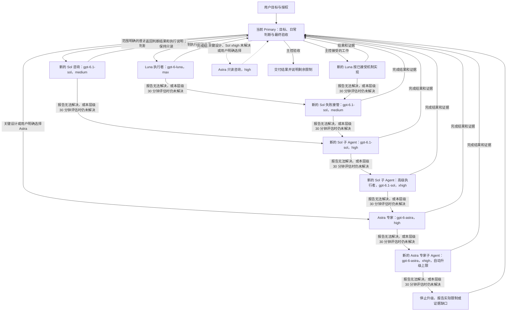

# PigeonStack：Codex 多 Agent 协作工作流

首先致敬并感谢 [Lauren Tan（poteto）](https://github.com/poteto)，[pstack](https://github.com/cursor/plugins/tree/77526ffa67f8dafc698d14b5356e6d4fc78c3127/pstack) 的原作者。PigeonStack 基于她的工作，为这套 Codex 协作流程做了定制适配。

[English](README.md) | 简体中文

[文档](https://pigeonai-yang.github.io/pigeonstack/zh/) | [快速开始](https://pigeonai-yang.github.io/pigeonstack/zh/getting-started/) | [常见问题](#faq) | [问题反馈](https://github.com/PigeonAI-Yang/pigeonstack/issues)

<p align="center">
  <a href="https://github.com/PigeonAI-Yang/pigeonstack/stargazers"></a>
  <a href="https://github.com/PigeonAI-Yang/pigeonstack/forks"></a>
  <a href="https://github.com/PigeonAI-Yang/pigeonstack/watchers"></a>
  <a href="#上游来源与许可"></a>
</p>
<p align="center">
  <a href="https://pigeonai-yang.github.io/pigeonstack/zh/"></a>
  <a href="#一个任务如何完成"></a>
  <a href="https://github.com/PigeonAI-Yang/pigeonstack/issues"></a>
  <a href="https://github.com/PigeonAI-Yang"></a>
  <a href="https://x.com/KimbomArtist"></a>
  <a href="https://www.xiaohongshu.com/user/profile/689af6b90000000019016082"></a>
</p>

**一套 Codex 协作工作配置：主控保留目标、日常判断与最终验收，Luna 执行已确定机制，Sol 处理范围明确的普通判断，Astra 负责关键设计或符合条件的接管。**

PigeonStack 是 PigeonYang 维护的一套 Codex 工作配置，包含全局指令、Lauren Tan 的 pstack 定制版、Agent 角色定义、宿主配置和本地同步脚本。一个源码仓库让这些职责和已安装指令都能被一并审查。

当前 Primary 保留任务目标、约束、日常判断、协同和最终验收。Luna 默认按已接受的机制执行常规工作。需要委派普通判断时，主控把一个范围明确的问题交给新的 Sol，从 `medium` 开始；Sol 返回判断结果和具体执行说明，主控接受后再交给新的 Luna 执行。真正的失败接管则由 Sol 或 Astra 负责诊断、实施和验证，直至完成。关键设计可以直接交给 Astra。

仓库交付的是指令、打包好的 Codex 插件和部署工具，不提供 MCP 服务或独立的自动调度器，也不会启动后台定时任务、常驻 Agent 或远程服务。仓库包含一个范围受限的 `SessionStart` 钩子；是否激活由宿主配置和信任状态决定。

## SessionStart 上下文钩子

只有当宿主事件中的会话和工作区与记录绑定一致时，`SessionStart` 钩子才会返回已保存任务记录的当前区域。它只加载已保存的任务上下文，不会排队或延迟消息。

源码还包含 `pstack/hooks/task_context.py`，供现有记录负责人读取并原位更新同一区域。更新使用整份记录的 SHA-256，保留区域外的字节，并归档完整旧正文。当前检查点建议保持简洁，以 4–8 KiB 为软目标。工具不会总结历史，也无法判断内容是否语义完整；它不会创建或验证 SessionStart 绑定。

当前正文上限仍为 16 KiB。Windows 包装器通过 `systemMessage` 返回读取故障。版本 `0.15.13+codex.20261009checkpoint` 已完成本地部署；已安装文件核对，以及针对真实任务记录的当前区域读取、更新、归档和读回流程均已通过。检查点从 29,370 字节缩减至 8,158 字节；完整旧正文已归档并核验，目标、权限和阻塞项得到保留，区域外历史保持不变。自然 `SessionStart` 行为仍未验证。验证细节见[维护证据](pstack/ADAPTATION.md#current-checkpoint-maintenance-2026-10-09)。

钩子不会监控后续业务状态、拦截 Agent 派发或强制执行协调者提醒。详见[钩子契约](pstack/hooks/README.md)和[Codex 宿主适配](pstack/CODEX.md)。

## 从这里开始

PigeonStack 将 Codex 全局规则、Agent 角色、配置和适配后的 pstack 插件保存在 Git 中，再同步到 Codex 宿主。

首次检查时，先看[独立目录预览](#在独立目录中预览)，或阅读[快速开始指南](https://pigeonai-yang.github.io/pigeonstack/zh/getting-started/)。

不确定当前任务适合哪个 pstack 技能？可以询问 `/poteto-help`。它会阅读已打包的指南，推荐相关技能，也可以提供一条示例提示词。单纯询问帮助不会开始执行推荐的工作。Codex 的模型选择和权限遵循本仓库的 GPT 配置。

已验证的宿主是 Windows 与 PowerShell，同步脚本要求 Python 3.11 或更高版本。真正安装插件还需要兼容的 Codex CLI，以及已有的、能解析 `pstack@personal` 的本地插件市场注册。

- 在 Git 中维护 Codex 全局规则，并与源码一起审查改动。
- 已确定机制下的常规执行交给 Luna。需要委派普通判断时，向 Sol 派发范围明确的咨询；主控接受其判断和执行说明后，再交给新的 Luna。关键设计直接交给 Astra。
- 保持维护中的源码、运行时文件和带版本的插件缓存同步。

## 为什么这样分工

如果每个子 Agent 都重新研究问题、自行决定修复方案，或者再找一个模型重复评审，多 Agent 协作就容易增加成本。如果把构建通过当成用户流程成功，交付结果也会失真。

PigeonStack 让一个主控对关键决策和最终验收负责。子 Agent 获取完成当前任务所需的上下文，执行边界明确的工作，再带回证据。独立任务可以并行，存在依赖或共用资源的操作则保留单一负责人。目标是用必要的最少改动交付完整、可验证的结果。

### 协调多个工作流

用户要求总控组织开发团队后，同一任务内的派工、回报、纠正和交接不再逐个代理、逐条消息请示。总控负责维护回报地址并随交接更新，Main 主动报告实质结果、阻塞和待决事项，省掉确认往返。不给其他代理发确认，不等于不给用户汇报：代理仍应简短说明处理了什么、当前进展和下一步，不能输出空回复；相关交流合并成一次有内容的汇报。版本 `0.15.13+codex.20261009team` 已部署到本地并核对安装文件，新会话中的实际行为仍待验证。详见[通信改动与验证边界](pstack/ADAPTATION.md#team-communication-and-user-visible-reports-2026-10-09)。

每个 Main 对完整任务负责到底，包括实现和真实验证，普通失败由它在自己的修复循环内解决。总控不反复检查中间补丁、不指定每条测试命令，也不逐次转发修复结果。Main 在任务完成，或遇到自己范围内无法解决的阻塞与决策时回报；总控审查最终证据，将具体验收差异交回同一个 Main 负责修正。用户指令、真实资源冲突和必须立即纠正的问题仍优先处理。用户持续获得有内容的进展汇报，不会收到空白最终回复。详见[COORDINATOR.md](pstack/COORDINATOR.md)；这些内容是行为指引，不是运行时强制能力。

| 角色 | 职责 | 建议的角色模型与推理强度 |
| --- | --- | --- |
| Primary 主控 | 负责目标、约束、日常判断、协同和最终验收。 | 建议默认值：`gpt-6.1-sol`，`high` |
| Luna 执行者 | 处理常规实现和操作、按指定只读清单采集证据、运行指定检查，以及忠实落实已批准内容的修改；将结果和证据交回主控。 | `gpt-6-luna`，`max` |
| Sol 高级执行者 | 范围明确的普通问题或委派判断从 `medium` 开始，返回判断结果和执行说明。咨询保持只读；获准的实现交给新的 Luna。真正的失败接管由 Sol 持续负责诊断、实施和验证。 | `gpt-6.1-sol`，先用 `medium` |
| Astra 专家 | 直接负责主架构或系统架构、关键接口和数据契约设计，以及会造成重大影响的取舍。其他接管仅在 Sol `xhigh` 实际报告无法解决或 30 分钟评估时仍未解决，或用户针对当前任务明确选择 Astra 时才开始。接管由 Astra 负责诊断、实施和验证。先用 `high`；仍未解决时转给新的 `xhigh` 专家，自动升级到此为止。 | `gpt-6-astra`，先用 `high` |

关键设计问题、Sol `xhigh` 实际报告无法解决或在 30 分钟评估时仍未解决的问题，或用户针对当前任务明确选择 Astra 模型时，可以进行 Astra 只读咨询。普通咨询从 Sol `medium` 开始，返回判断结果和执行说明，不负责应用实现。所有咨询和子 Agent 均由主控派发；接管任务使用明确指定模型和强度的通用执行角色。

这些名称表达的是本项目的模型使用策略和本机配置。实际可用模型、模型 ID、推理强度与费用取决于账号和 Codex 客户端。仓库没有提供速度提升、成本节省或跑分领先的实测承诺。

[MODELS.md](pstack/MODELS.md) 建议 Primary 角色默认使用 `gpt-6.1-sol`、`high`。仓库提交的[配置文件](config/workflow.toml)保留了当前显式选择的 `gpt-6-astra`、`high`。两者用途不同：修改任一文件都不会切换已运行的会话，模型标签也不能证明服务端内部的模型映射。当前任务明确指定的模型和强度优先于角色默认值。Sol 高级执行者是独立子 Agent，从 `medium` 开始；同一个未解决问题可依次进入 Sol `high`、`xhigh`，再到 Astra `high`、`xhigh`。

## 一个任务如何完成



普通实现和操作由 Luna 按已接受的机制执行。主控需要委派日常判断时，将一个范围明确的问题交给新的 Sol，从 `medium` 开始；Sol 返回判断结果和执行说明，咨询保持只读。主控接受后，再由新的 Luna 执行获准的工作。若 Luna 无法完成已分配的任务，新的 Sol `medium` 接管同一个问题，负责诊断、实施和验证。未解决的问题或接管按 Sol `medium`、`high`、`xhigh` 的顺序推进，然后才进入 Astra `high`；不跳过层级。主架构或系统架构、关键接口和数据契约设计、重大设计取舍可以直接交给 Astra。用户针对当前任务明确选择的模型和强度优先。每个新任务从适用角色默认强度开始；只有同一个未解决任务的升级交接才进入下一层。“技术文档”标签或主控单纯感到不确定，都不足以触发 Astra。Astra 已认可决定后的常规修改交给 Luna；新的普通判断交由 Sol 给出决定和执行说明，接受后的实现仍交给 Luna；新的关键决策交给 Astra。Primary 保留日常判断和最终验收。

常规的 ZIP 上传与发布、Git 操作、安装、创建代码仓库、按既定平台流程执行、常规实现，以及忠实更新已批准的公开文案或网页，都交给 `max` 强度的 Luna。操作说明需列明产物、目标位置、已授权步骤、成功后的回读方式和停止条件。核心架构决策不交给 Luna。任务规模、视觉复杂度、“技术文档”标签或主控单纯感到不确定，都不会触发 Astra。发布、陌生工具或操作失败本身不会改变任务分工。

主控将实现工作交给 Luna 前，需要写清以下内容：

1. 一个缺陷或可独立验证的步骤，包括实际失败和关键证据。
2. 已选定的机制、预期行为和具体修改步骤。
3. 允许修改的文件与接口、资源归属，以及排除范围。
4. 要运行的检查，以及哪些观察结果可以证明成功。
5. 哪些假设不成立或失败出现时，必须及时交回主控。

接管时，向高级执行者或专家说明目标、约束、证据、范围、权限和验收条件。高级执行者和专家自主选择技术方案、实施必要修改并验证完整结果，不需要主控逐步审批。只有遇到外部阻塞、确需用户决定、需要变更范围或权限，或发现紧急正确性与资源归属问题时才提前返回。

按清单采集只读证据可以先于诊断。此类任务明确指定搜索或观察内容，由主控解释结果。Luna 不接收开放式架构决策，也不接收一批原因未明的失败并自行修复。需要委派普通判断时，向新的 Sol 派发范围明确的咨询；Sol 返回判断结果和执行说明，不负责应用实现。主架构或系统架构、关键接口和数据契约设计、重大设计取舍才直接交给 Astra。

需要 ComputerUse 的操作只由主控执行，因为子 Agent 没有这些工具。不要把需要 ComputerUse 的操作委派给子 Agent。高级执行者或专家可以请主控执行一项明确的 UI 操作并报告观察结果，然后继续处理同一个问题。这是请求观察结果，不是让主控决定如何解决问题。文字、代码、CLI 和 API 工作仍可委派。这条规则不增加工具或权限流程。

调度以实际就绪状态为准。独立任务一起派发，有任务完成后立即推进新解锁的工作。冲突写入、共用实例操作和真实依赖需要串行。每次任务都创建新的子 Agent，已完成的子 Agent 不再复用。没有独立工作可做时，使用默认 30 分钟（`1800000` 毫秒）的可中断等待；收到新输入或子 Agent 事件时会提前返回。不强制组织模型评审团，也不为了填满并发槽而制造任务。Primary 与子 Agent 之间的生图、图像编辑、查看、视觉分析及相关传输需要串行，一次只处理一项。

执行者报告无法解决时，立即进入下一层，不等 30 分钟。未提前报告失败时，在该模型和强度层级首次派发满 30 分钟后评估。同一层级的重试或替换执行者不会重置计时。升级时保留证据、失败尝试和累计耗时。Luna 开始的执行任务在无法解决或评估仍未解决时，升级路径为 Luna `max`、Sol `medium`、Sol `high`、Sol `xhigh`、Astra `high`，最后是新的 Astra `xhigh` 子 Agent。普通咨询从 Sol `medium` 开始，并在升级中保持只读；真正的失败接管从 Sol `medium` 开始，由接管者持续负责修复和验证。关键设计从 Astra `high` 开始。完成的层级即结束升级。每个新任务从适用角色的默认强度开始，除非用户明确指定模型或强度；只有同一个未解决任务的升级交接才进入下一层。同层级重试或替换仍使用该层级且不会重置计时。外部阻塞，包括所需模型或强度、凭据、访问、权限或服务不可用，不会触发推理升级。已确认健康的长时间构建、下载或训练不是推理失败，继续现有观察流程。Astra `xhigh` 报告无法解决或在本层级 30 分钟评估时仍未解决，就停止升级并报告实际限制或证据缺口。不自动升到 Astra `max`、`ultra`，也不重启升级循环。这些评估使用现有等待工具和任务上下文，不会自动运行计时器。

例如，用户可以提出：

> 修复报表没有数据行时的导出错误。保持现有文件格式，同时验证正常导出流程。

主控先检查关键证据，或安排明确的复现清单，再把已选定的修复和检查交给 Luna。如果 Luna 报告无法解决导出错误，主控就把同一个问题交给新的 `medium` Sol 高级执行者。问题仍未解决时，依次进入 Sol `high`、Sol `xhigh`，再按需进入 Astra `high` 和 `xhigh`。高级执行者或专家自主选择方案、实施和验证，再将结果和证据交回主控最终验收。这个例子用于说明工作方式，不是已完成的测试记录或性能测量。

## 仓库里有什么

| 源码位置 | 用途 |
| --- | --- |
| [AGENTS.md](AGENTS.md) | 全局范围、授权、委派、调度与验收规则。 |
| [pstack/CODEX.md](pstack/CODEX.md) | Codex 工作流入口、工具转换、执行说明与部署约定。 |
| [pstack/MODELS.md](pstack/MODELS.md) | 模型 ID、推理强度与子 Agent 创建约定。 |
| [pstack/](pstack/) | 打包的 pstack 插件、选定技能、操作流程、上游资料和本地适配。 |
| [agents/](agents/) | `worker`、`poteto-agent` 与供可选咨询使用的只读 `astra-advisor` 兼容角色。 |
| [prompts/](prompts/) | 部署配置所引用的基础指令文件。 |
| [config/workflow.toml](config/workflow.toml) | PigeonStack 管理的配置白名单。 |
| [scripts/sync.py](scripts/sync.py) | 只读差异检查，以及带备份和回读验证的单向部署。 |

规则的归属明确：全局 `AGENTS.md` 管政策，`CODEX.md` 管宿主机制，`MODELS.md` 管模型 ID 和推理强度。随附技能为选中的步骤提供做法。上游技能的触发条件和角色默认值不能覆盖 Codex 宿主规则。

只加载当前决策需要的技能与参考资料。已知的局部修复不必重新做架构研究，闲聊和直接事实问答也不必启动完整流程。保留的部分上游内容仍使用 Cursor 工具名，或依赖可选的外部集成。[CODEX.md](pstack/CODEX.md) 说明宿主转换方式，[ADAPTATION.md](pstack/ADAPTATION.md) 记录适配边界。仓库保留的自动化示例仅作参考，未启用。

## 检查并适配源码

在你选择的目录中克隆仓库：

```powershell
git clone https://github.com/PigeonAI-Yang/pigeonstack.git
Set-Location pigeonstack
```

当前验证过的宿主环境是 Windows 与 PowerShell。同步脚本要求 Python 3.11 或更高版本。真正安装插件需要兼容的 Codex CLI，以及已经存在、能够解析 `pstack@personal` 的本地插件市场注册。多 Agent 执行还需要 Codex 环境提供原生子 Agent 工具，并且账号可以使用所选模型。

这是从个人实际使用环境整理出来的仓库，换机器时需要适配路径。将目标指向真实 Codex 目录之前，先检查这些位置：

- [scripts/sync.py](scripts/sync.py) 中的 `DEFAULT_HOME` 当前固定为 `J:/Users/yangda01/.codex`。
- [AGENTS.md](AGENTS.md)、[CODEX.md](pstack/CODEX.md) 和 [poteto-agent.toml](agents/poteto-agent.toml) 含有维护者机器上的源码或运行时路径。
- [config/workflow.toml](config/workflow.toml) 保留此仓库当前显式选择的 `gpt-6-astra`、`high`，以及 Agent 设置、角色文件和插件启用项。部署前确认需要采用的设置；修改源码文件不会切换已运行的会话。

脚本不会自动注册插件市场，也不是零配置安装器。`--codex-home` 参数不会重写指令中嵌入的所有路径。在其他位置正式安装前，需要修改维护中的源码，并适配已有的本地插件市场注册。

### 在独立目录中预览

在克隆后的仓库目录中，使用一个新的同级目录查看同步结果，避免直接指向日常使用的 `.codex`：

```powershell
python scripts/sync.py check --codex-home ../pigeonstack-preview-codex --skip-plugin-install
python scripts/sync.py deploy --codex-home ../pigeonstack-preview-codex --skip-plugin-install
python scripts/sync.py check --codex-home ../pigeonstack-preview-codex --skip-plugin-install
```

首次检查通常会报告差异，因为目标目录为空。部署会将受管理的文件和配置写入预览目录，最后一次检查在内容一致时返回 `status: ok`。非默认目标必须带 `--skip-plugin-install`，源码目录与目标目录不能重叠。

这个预览会跳过插件安装和已安装缓存检查。它验证的是文件副本和配置合并，不能证明插件已激活或模型协作行为已经生效。尚未适配的宿主路径仍会保留在复制后的指令里。

### 在已配置的宿主上部署

在维护者当前机器上，审查目标改动和已有的 `pstack@personal` 注册后，使用：

```powershell
Set-Location J:/PigeonYang/pigeonstack
python scripts/sync.py check
python scripts/sync.py deploy
python scripts/sync.py check
```

这些命令指向配置中的真实 Codex 目录，会更新全局指令和模型设置。在其他机器上采用同样的命令顺序前，先完成上面的路径与配置检查。

存在改动时，脚本复制受管理文件、合并白名单配置项，并将 `model_instructions_file` 指向目标目录里的基础提示文件。如果运行时或已安装缓存存在差异，还会调用：

```powershell
codex plugin add pstack@personal --json
```

随后脚本回读运行时文件和配置，并将安装后的插件文件与源码比较。插件安装可能在运行时文件已经写入后失败；需要查看错误与备份路径，不能将失败理解为自动回滚。

`check` 在内容一致时返回 `0`，存在差异时返回 `1`。参数无效或操作出错时返回 `2`。安装成功、文件一致只能证明磁盘状态；要确认完整协作行为在自己的宿主上成立，还需要在新的 Codex 会话中验证指令加载和实际模型路由。

## 只维护一份源码

维护者机器上的部署方向为：

```text
J:/PigeonYang/pigeonstack
    -> J:/Users/yangda01/.codex 中的受管理文件和 local-plugins/pstack
    -> 已安装的 pstack 插件缓存
```

修改源码仓库，运行时文件与安装缓存都作为部署副本。首次导入是一次快照，之后仍是单向同步。如果改动了运行时副本，需要先审查并明确带回源码，再做部署。

日常维护按以下顺序进行：

1. 修改维护中的源码，验证受影响的文件。
2. 涉及插件改动时，按照 `CODEX.md` 更新插件版本和已有插件市场的缓存版本标记。
3. 运行 `python scripts/sync.py check`，审查预期差异。
4. 部署已授权的改动。被覆盖的现有文件会备份到 `<codex-home>/backups/pigeonstack/`。
5. 再次运行 `check`，审查最终差异和相关行为证据，获得当前任务授权后提交。

内容未变化时，部署不会写入受管理文件，也不会新增备份。部署保留无关的已解析配置值，不删除运行时目录中的额外文件。已安装插件检查会报告缓存里的额外文件。受管理配置中不支持的多行值或复杂值会在写入运行时之前报错。

源码不包含实际凭据、对话历史或运行时状态。本地备份、认证信息、会话记录和生成的缓存应留在仓库之外。配置合并只管理明确列出的白名单，以及根据目标目录生成的 `model_instructions_file` 路径。

## 交付边界

规则要求保留用户改动和来源不明的文件，不自动暂存、重置或清理工作区。问题与诊断默认只读。技能不会扩大授权，发布、部署、提交、破坏性操作和向外部发送消息，都需要当前任务中的授权。

验收证据必须支持承诺的结果。构建通过、模拟测试、命令回执或子 Agent 报告，单独都不能证明实际业务流程成功。要声称某项行为成立，应通过现有 UI、CLI 或业务入口验证。服务不可用或访问被拒绝时，说明受影响的证据缺口，继续完成不依赖它的已授权工作。

优先通过现有入口推进已授权的正常业务流程。实际遇到或收到 BUG 报告时，保留足够的证据，在授权范围内定位并修复原因，再重跑受影响的真实业务流程并完成针对性回归。遇到问题就处理，不必等整个流程结束。仅阻塞受影响的操作及其依赖操作，继续推进独立且有效的工作。真实流程不可用时，明确说明尚未验证的结果。针对性回归不代表获准运行全量测试。

日常任务中，优先复用现有脚本、CLI 和业务入口。只有观察到已授权的实际需要，才为可重复的确定性工作增加最小工具。让负责该项工作的 Agent 能检查真实结果。升级模型前，先区分工具、反馈或环境缺口与推理失败。任务结束时，利用已收集的证据找出反复出现的问题，并以范围内最小的相关改动改进代码、工具、技能或规则。无关发现记入现有项目记录。这些习惯不会额外要求必须扫描项目、提交报告、新建技能或 harness、添加验证门，或自动复盘。

校验门是操作继续前必须通过的强制检查。只有问题已被证据确认，或存在明确的当前要求时，才可新增校验门。不得将未经证实的猜测或假设的未来失败转化为新的校验门或前置条件。确认 BUG 也不意味着必须加门。确有需要时，将校验门限定在受影响的操作和边界内，验证它能捕获该问题或落实当前要求，且不无故阻断有效工作。现有必需检查、明确的当前要求，以及安全、权限和数据完整性边界，均在 BUG 发生前就适用。

这些机制是 Agent 指令和配置约定，不是运行时强制钩子。磁盘同步、插件安装验证、当前任务已读取的指令，以及新会话实际表现，需要分别说明。

## 更新日志

### 2026-10-10 | `0.15.13+codex.20261010brief`

- 专项 Main 派工统一为四项：目标、可检查的完成条件、验收证据、必要约束。
- 全局规则、总控指南和基础指令统一引用 CODEX.md 中的唯一模板；负责人和返回地址属于交接信息，不增加前置条件。
- 内部执行简报和模型路由保持不变。源码检查通过，新会话行为尚未实测。

### 2026-10-10 | `0.15.13+codex.20261010outcome`

- 总控主动撤销自身过时的方法限制，在同一轮把未完成目标交回负责的 Main 执行。
- 按验收需求处理证据缺口：安排必要调查或采集，可暂缺的未知项不阻塞已有证据支持的工作。
- 来源缺口、当前方法耗尽或记录部分交付，不能单独作为结束理由；外部依赖必须明确缺少的具体输入，且没有其他可推进工作。
- 源码与配置检查已通过；新会话行为尚未实测。

### 2026-10-10 | `0.15.13+codex.20261010progress`

- 30 分钟改为进展检查点，不再是任务完成期限。有实质进展且下一步明确时，原代理、原模型继续执行，Astra xhigh 同样适用。
- 只有证据表明确实无法继续推进时才升级。外部阻塞由对应负责人处理；近期没有聊天输出不等于停滞。
- 同步修正全局规则、模型路由、总控指南、基础提示词和运行配置。保留自动升级档位上限，不再把它当作执行时限。

### 2026-10-10 | `0.15.13+codex.20261010continuation`

- Main 用 commentary 回答临时插问后继续原任务；子代理运行时使用原生等待，返回后先处理结果，避免以“还有工作待完成”提前结束回合。
- 总控在 30 分钟内检查未完成的 Main 任务。正常执行者不受打扰；确认提前结束时，沿用原任务和已有结果，每个已结束回合只发送一次续办指令。
- 两项受控 Desktop 实测通过：插问后继续处理，以及通过一次续办消息恢复空闲 Main。恢复测试使用 15 秒检查期限，未跑满 30 分钟；这些规则不是运行时强制机制。

### 2026-10-09 | `0.15.13+codex.20261009wait`

- 总控没有独立工作、只等 Main 汇报时，改用可中断的 30 分钟 `clock.sleep`，避免两分钟一次的 `wait_threads` 循环；可执行工作和更早的操作期限优先。
- 已实测独立 Desktop 聊天消息让 180 秒等待在第 41.223 秒提前结束。Main 必须主动发送完成或阻塞报告，仅结束自身聊天不会通知总控。30 分钟参数在工具允许范围内，本次实测采用的是 180 秒。

### 2026-10-09 | `0.15.13+codex.20261009lean`

- 按下一步实际需要读取上下文并开工，复用已确定的结论和已有证据，不再要求先备齐完整计划及后续步骤的条件。
- 共享资源在相关操作开始前安排好，独立工作可以先推进。派工明确验收标准，完成证据在执行过程中取得。
- 三份规则总量减少约 30%，总控指南缩减约一半；合并重复的准备与收尾要求，保留必要权限、资源独占和最终验收；尚未重新验证代理实机表现。

### 2026-10-09 | `0.15.13+codex.20261009outcome`

- 总控一次交付完整目标，Main 自主负责诊断、实现、集成、验证与修复；总控在最终交付时验收，不再逐阶段批准。
- 共享资源操作者直接向负责该目标的 Main 返回结果。普通失败留在 Main 内部修复；总控只介入真实外部阻塞、跨负责人冲突、必须立即纠正的问题和用户新指令。
- 保留面向用户的实质进展汇报，避免确认循环、零碎指挥和空回复。用户停止联系团队的指令继续有效，本版尚未重新验证团队实机表现。

### 2026-10-09 | `0.15.13+codex.20261009checkpoint`

- 新增读取和更新现有标记区域的命令行工具。更新会比较整份记录的 SHA-256、保留区域外的所有字节、归档完整旧正文，并核对替换后的记录。
- 钩子的当前正文上限仍为 16 KiB。建议以 4–8 KiB 作为维护软目标，不增加强制门禁；工具不会总结内容，也无法判断语义是否完整。
- 版本 `0.15.13+codex.20261009checkpoint` 的 plugin-only 部署和已安装缓存检查均返回 `ok`，243 个托管文件无漂移。
- 对真实任务记录的更新将当前检查点从 29,370 字节缩减至 8,158 字节。完整旧正文已归档并核验；目标、权限和阻塞项得到保留，区域外历史保持不变。自然 `SessionStart` 行为仍未验证。
- 负责人先阅读简短的当前检查点，再按需查看相关任务和证据引用。


## 参与改进

围绕已观察到的问题或当前需求修改。复用已有源码与验证入口，保留无关改动，并说明支持修改的证据。中英文介绍应保持一致。

全局指令、角色定义和规则更新保持英文，中文 README 属于公开项目介绍。按决策内容选择角色，不按文件类型判断：Luna 执行已接受的机制；Sol 提供范围明确的普通判断并返回执行说明；只有真正的失败接管才由 Sol 或 Astra 持续负责实施和验证。主架构、系统架构、关键接口和数据契约设计及重大取舍交给 Astra。保留上游署名，在 [ADAPTATION.md](pstack/ADAPTATION.md) 中记录适配变更。

<a id="faq"></a>

## 常见问题

### PigeonStack 是 MCP 服务、Skill 还是 Agent？

它是包含 Codex 插件及配套指令、工具的仓库。插件打包选定的 pstack 技能和 Codex 适配层；全局规则、角色定义、配置与同步脚本则在仓库中与插件分别维护。它不运行 MCP 服务或自主调度器。

### PigeonStack 与 pstack 有什么区别？

PigeonStack 将 Lauren Tan 的 pstack 适配到 Codex，增加 Codex 专用全局规则、宿主适配器，以及面向运行时文件和插件缓存的版本化同步。仓库保留对 Lauren Tan 的作者署名与致谢。详见[上游来源与许可](#上游来源与许可)。

### 可以在不改动 `.codex` 目录的情况下预览吗？

可以。按照上面的独立目录预览步骤，指定 `.codex` 目录之外的新 `--codex-home` 路径，并加上 `--skip-plugin-install`。脚本只会在该目标中写入受管理文件和合并后的配置，不会安装插件或更改日常使用的 Codex 宿主；因此这次检查不能证明模型协作行为已经生效。

### PigeonStack 能让 Codex 更快或更省钱吗？

目前没有发布速度或成本基准测试。以更节省成本的方式协作是设计目标，不是实测结论。可用模型和原生子 Agent 工具取决于 Codex 宿主与账号。

## 上游来源与许可

PigeonStack 由 PigeonYang 维护，底层 pstack 工作流来自 Lauren Tan。仓库基于 pstack `0.15.13` 的[固定上游版本](https://github.com/cursor/plugins/tree/77526ffa67f8dafc698d14b5356e6d4fc78c3127/pstack)适配，对应提交 `77526ffa67f8dafc698d14b5356e6d4fc78c3127`。选入的控制与代码清理技能来自同一版本中的 Cursor Team Kit。

基于 pstack 0.15.13，包含用于处理反复出现的 Agent 错误的 `/correct`、用于提供性能证据的 `/benchmark-checklist`，以及用于解释测量数据的 `/principle-explain-the-number`。上游工作流已适配到 Codex；模型选择和升级路径遵循本项目的 GPT 配置。

[provenance.json](pstack/provenance.json) 记录导入文件及其源文件哈希，[ADAPTATION.md](pstack/ADAPTATION.md) 记录 Codex 适配及变更历史。原有许可声明保留在 [pstack/LICENSE](pstack/LICENSE) 和 [pstack/CURSOR-TEAM-KIT-LICENSE](pstack/CURSOR-TEAM-KIT-LICENSE)。

这些 MIT 声明适用于各自的上游材料。仓库目前没有单独的根目录许可证，将相同许可统一授予所有 PigeonStack 原创内容。
